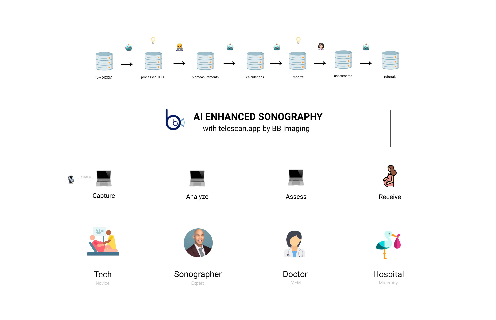

# technical-assessment

At BB Imaging, we're building TeleScan: an AI enhanced workflow to empower our sonographers to better serve our patients.

## Technologies that we use

Our Service-Oriented Architecture allows us to use the right tool for the right job. Generally speaking we believe consistency is king, and try to keep our services in fullstack TypeScript, but Python rules the day for data processing and ML. We believe in not reinventing the wheel, and leverage open-source where appropriate. Some of our toolkit includes:

- Languages and Frameworks: TypeScript, Python, Node, Angular, Flask
- AWS: Lambda, ec2, API Gateway, DynanmoDB, S3, SageMaker, Codebuild
- DevOps: Serverless, Github Actions

## Our Product and SDLC Processes

We operate in a HIPAA compliant SDLC environment. Telescan is an FDA regulated Class II device, and requires the focus, process, and structure that patients need. That said, our processes probably look pretty familiar to the modern engineer, including:

- 2 week sprints
- GitFlow
- Stories in Airtable
- Dev tasks in Github

## Technical Assessment Process

If you're at this page, you've likely already engaged with our amazing People & Culture team. If not, and you are interested in a position with our team, please reach out to Alison Dilly at alison@bbimaging.net.

You will have 72 hours to: 

1) submit your project. Your project should be contained in a public github repo. Once complete, please send the link to alison@bbimaging.net. 

2) schedule a 60 minute meeting to review the project with the team. Please [use this link](https://calendly.com/alisoncamp/60min) to schedule. In order to give our team time to review, schedule your review for the following day (or as soon as appropriate) after your project submission.

Questions? Please feel free reach out to alison@bbimaging.net! 
